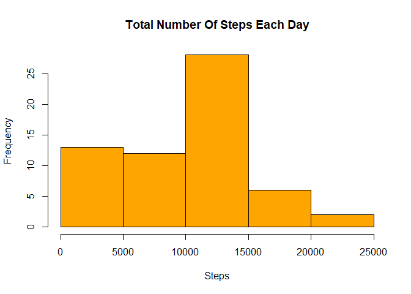
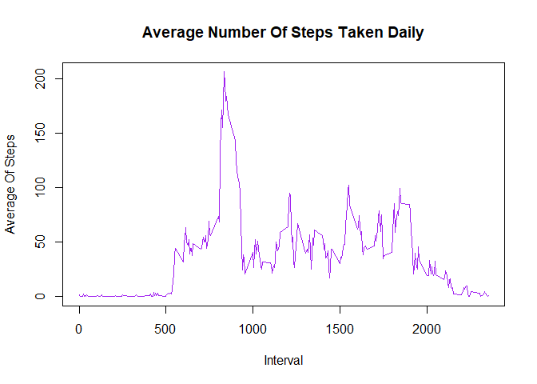
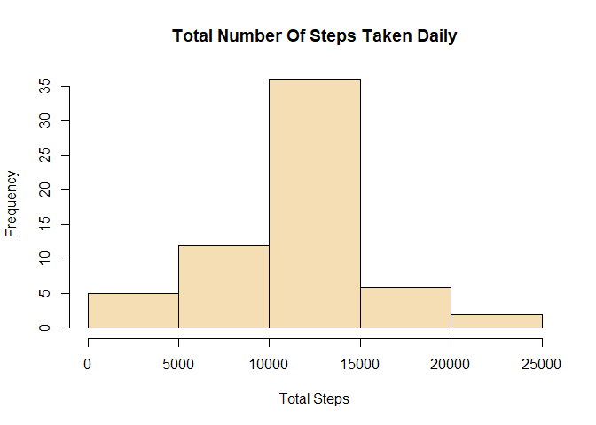
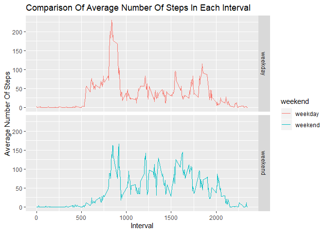

## Loading and processing the data

**1-Load the data**

```r
if(!file.exists("C:/Users/Super/Desktop/RepData_PeerAssessment1/activity.csv")){
  unzip("C:/Users/Super/Desktop/RepData_PeerAssessment1/activity.zip")
}

activityData <- read.csv("C:/Users/Super/Desktop/RepData_PeerAssessment1/activity.csv",header = TRUE)
head(activityData,3)
```

```
##   steps       date interval
## 1    NA 2012-10-01        0
## 2    NA 2012-10-01        5
## 3    NA 2012-10-01       10
```
**2.Process the data**

```r
#activityData$interval <- strptime(gsub("([0-9]{1,2})([0-9]{2})", "\\1:\\2", activityData$interval), format='%H:%M')
```

## What is mean total number of steps taken per day?

**1.Calculating total number of steps taken per day**

```r
totalSteps <- activityData %>% select(date,steps) %>% group_by(date) %>%
  summarize(Total.Steps = sum(steps,na.rm = TRUE))
head(totalSteps,3)
```

```
## # A tibble: 3 x 2
##   date       Total.Steps
##   <fct>            <int>
## 1 2012-10-01           0
## 2 2012-10-02         126
## 3 2012-10-03       11352
```
**2.Make a histogram of the total number of steps taken each day**

```r
hist(totalSteps$Total.Steps,main = "Total Number Of Steps Each Day",xlab = "Steps",ylab = "Frequency",col = "orange")
```

<!-- -->
**3.Calculating mean and median of total number of steps taken daily**

```r
stepsMean <- mean(totalSteps$Total.Steps)
stepsMedian <- median(totalSteps$Total.Steps)
```
* Mean of total steps taken daily = 9354.2295082
* Median of total steps taken daily = 10395

## What is the average daily activity pattern?

**1.Make a time series plot of the 5-minute interval and the average number of steps taken daily**

```r
averageOfActivity <- activityData %>% select(interval,steps) %>% na.omit() %>%
  group_by(interval) %>% summarize(Average.Steps = mean(steps))
head(averageOfActivity,3)
```

```
## # A tibble: 3 x 2
##   interval Average.Steps
##      <int>         <dbl>
## 1        0         1.72 
## 2        5         0.340
## 3       10         0.132
```


```r
plot(x=averageOfActivity$interval,y=averageOfActivity$Average.Steps,type="l",
main = "Average Number Of Steps Taken Daily",xlab = "Interval",ylab = "Average Of Steps",col="purple")
```

<!-- -->

**2.Which 5-minute interval contains maximum number of steps?**

```r
maxSteps <- averageOfActivity[which(averageOfActivity$Average.Steps==max(averageOfActivity$Average.Steps)),]
maxSteps
```

```
## # A tibble: 1 x 2
##   interval Average.Steps
##      <int>         <dbl>
## 1      835          206.
```
* Maximum steps at interval **835** which is **206.1698 steps**

## Imputting Missing Values

**1.Calculating total number of missing values in the dataset**

```r
totalMissingValues <- sum(is.na(activityData$steps))
```
* Total number of missing values 2304

**2.Devise a strategy for filling in all of the missing values in the dataset.**

* Iam using **mean** function to replace all the missing values in the dataset.

```r
replacingMissingValues <- function(x) replace(x,is.na(x),mean(x,na.rm = TRUE))
```

**3.Create a new dataset that is equal to the orignal dataset but with the missing data filled in**

```r
newDataset <- activityData %>% group_by(interval) %>% mutate(steps=replacingMissingValues(steps))
head(newDataset,3)
```

```
## # A tibble: 3 x 3
## # Groups:   interval [3]
##   steps date       interval
##   <dbl> <fct>         <int>
## 1 1.72  2012-10-01        0
## 2 0.340 2012-10-01        5
## 3 0.132 2012-10-01       10
```
**4(i).Make a histogram of the total number of steps taken each day**

```r
totalStepsDaily <- newDataset %>% group_by(date) %>% summarize(Total.Steps = sum(steps))

hist(totalStepsDaily$Total.Steps,main = "Total Number Of Steps Taken Daily",xlab = "Total Steps",ylab = "Frequency",col = "wheat")
```

<!-- -->
**4(ii).Calculating mean and median total number of steps taken each day**

```r
newMean <- mean(totalStepsDaily$Total.Steps)
newMedian <- median(totalStepsDaily$Total.Steps)
```
* **Mean** = 1.0766189\times 10^{4} and **median** is = 1.0766189\times 10^{4}

**4(iii).Do these values differ from the estimates from the first part of the dataset**

```r
oldMean <- mean(totalSteps$Total.Steps)
oldMedian <- median(totalSteps$Total.Steps)
```
* Yes values of mean and median are different from the first part of the assignment
  * old mean = 9354.2295082 and new mean = 1.0766189\times 10^{4}
  * old median = 10395 and new median = 1.0766189\times 10^{4}

## Are there differences in activity patterns between weekdays and weekends?

**1.Create a new factor variable in the dataset with two levels – “weekday” and “weekend” indicating whether a given date is a weekday or weekend day**

```r
newDataset$date <- as.Date(newDataset$date)
newDataset$weekday <- weekdays(newDataset$date)
newDataset$weekend <- ifelse(newDataset$weekday=="Saturday" | newDataset$weekday=="Sunday","weekend","weekday")
```

**2.Make a panel plot containing a time series plot of the 5-minute interval (x-axis) and the average number of steps taken, averaged across all weekday days or weekend days (y-axis)**

```r
dataWendWday <- aggregate(newDataset$steps,by=list(newDataset$weekend,newDataset$interval),na.omit(mean))

names(dataWendWday) <- c("weekend","interval","steps")

ggplot(dataWendWday,aes(x=interval,y=steps,color=weekend))+geom_line()+facet_grid(weekend~.)+xlab("Interval")+ylab("Average Number Of Steps")+ggtitle("Comparison Of Average Number Of Steps In Each Interval")
```

<!-- -->
